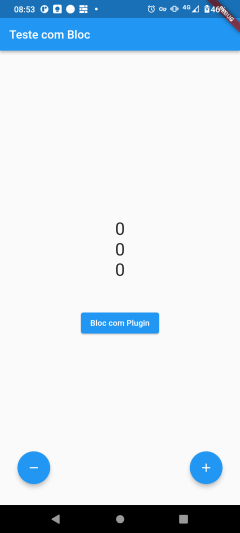
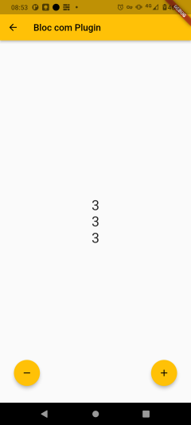

Sobre o app
====================

Estudo sobre implementação de gerencia de estados utilizando a arquitetura Bloc.
Fiz a implementação tanto sem usar plugin, como usando o plugin **flutter_bloc**.

App de exemplo baseado no app Contador que é criado como exemplo para cada novo projeto Flutter.

Na página principal do app, é feita a implementação sem usar qualquer plugin.
Foi implementado 3 contadores que "escutam" alterações em um bloc via StreamBuilder.

Na 2a página, o mesmo exemplo só que usando BlocProvider/BlocBuilder para conferir reatividade a aplicação
e manutenção do estado do Bloc entre telas.

Tela do app
============

|&nbsp;|&nbsp;|
|----|----|
||Bloc puro|
||BlocProvider/BlocBuilder|
