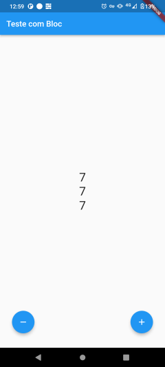

Sobre o app
====================

Estudo sobre implementação de gerencia de estados utilizando a arquitetura Bloc.

App de exemplo baseado no app Contador que é criado como exemplo para cada novo projeto Flutter.

Aqui, implementamos 3 observadores (StreamBuilders) que vão ficar escutando eventos sendo gerados pelo objeto Bloc.

Temos o evento de incrementar o contador e decrementar e 3 contadores simulam diferentes partes do app que poderiam estar sendo atualizadas baseadas no novo estado sendo emitido pelo objeto Bloc.

Tela do app
============

|&nbsp;|&nbsp;|
|----|----|
||Tela do app|
