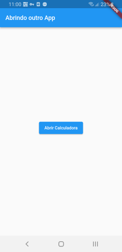

Sobre o app
====================

Estudo sobre Platform Channel.

Platform Channel é uma forma de conseguimos realizar tarefas no Dart/Flutter que dependem
de acesso mais de baixo nível ao Android/iOS o qual ambos não possuem acesso direto, tal como seria com um app Android nativo com Java.

Com Platform Channel é possível chamar uma implementação de uma rotina feita em Java ou
mesmo uma API do Android. O caminho contrário também é possível, ou seja, código Java
chamar alguma implementação em Dart/Flutter.

Neste exemplo é implementado um botão que quando tocado, chama uma rotina Java
para disparar um Intent e abrir o app da Calculadora. A execução com sucesso da calculadora
depende se o nome do pacote informado na chamada da rotina *_abrirCalculadora* está
fornecendo o nome do pacote da aplicação correto para a marca e modelo do dispositivo,
isto porquê o nome pode variar pois cada fabricante pode acabar customizando este aplicativo
e utilizando um nome diferente.

Tela do app
============

|&nbsp;|&nbsp;|
|----|----|
|| Tela do app|