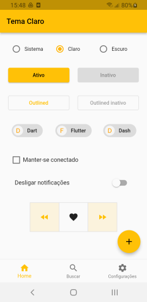
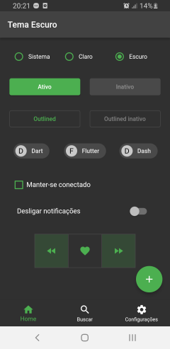

Sobre o app
====================

Estudo sobre troca de tema claro (default), por escuro.

A idéia aqui foi centralizar o theming da aplicação em uma classe que pode ser facilmente copiada para outros projetos.

As configurações das cores no modo Dark fica a cargo do usuário e não existe um padrão 'de-facto', assim como não existe um padrão de cores para o modo claro, é tudo uma questão de estética e escolha particular de cada um.

Ao selecionar cada radio button, é feita a troca do tema usado por toda a aplicação.

Tela do app
============

|&nbsp;|&nbsp;|
|----|----|
|Tema claro (light mode)| Tema escuro (dark mode)|
|| |
