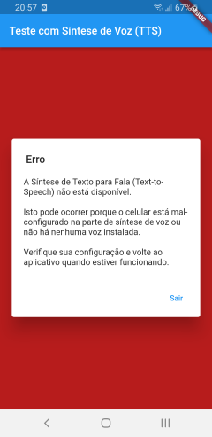
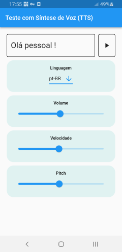

Sobre o app
====================

Estudo sobre síntese de fala (Text-to-Speech) usando Flutter.

A síntese de fala está implementada não só em celulares, como relógios e outros eletrônicos.
Adiciona comodidade pois não se requer ver um visor ou tela, para se obter informações.
Para pessoas com dificuldades visuais, é um componente fundamental que participa em seu dia-a-dia.

Alguns tipos de app podem se beneficiar de TTS para informar o usuário de alguma condição, evitando com que ele gaste tempo de ter que pegar o celular ou ficar consultando a tela de tempos em tempos.

Neste app eu utilizo o plugin [flutter_tts](https://pub.dev/packages/flutter_tts) para ter acesso
ao engine de Text-to-Speech do Android.

Notas:

- Nem sempre o celular de um usuário está configurado para fazer uso da síntese de voz e em virtude
disso, pode ser que ao executar esta aplicação em seu dispositivo, uma mensagem de erro aparecerá,
ou nada será ouvido.

- Recomenda-se que se entre nas configurações de síntese de fala, faça testes para ver se está
funcionando e se será necessário fazer download de alguma voz no idioma que se deseja, para só
daí testar esta aplicação.

Telas do app
============

|&nbsp;|&nbsp;|
|----|----|
|| Tela de erro indicando que a síntese de fala não está disponível|
|| Tela do app|